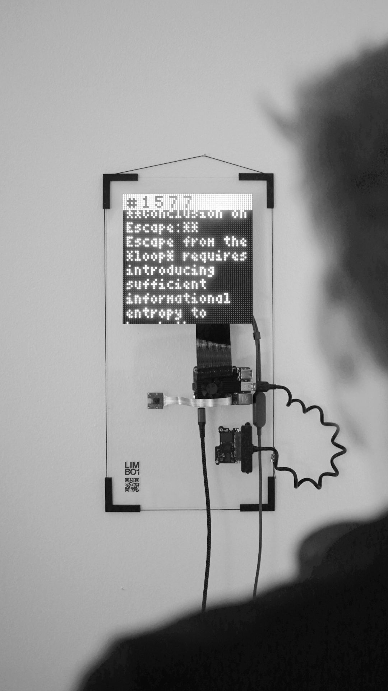

# LIMBOi 1.1

An art installation by [AOP.Studio](https://aop.studio) / [Moritz Pongratz](https://moritzpongratz.com)

**[→ Live at aop.studio/limbo1](https://aop.studio/limbo1)**



---

## Concept

Gemma 4 E2B runs locally on a Raspberry Pi 5 hanging on a studio wall. Every cycle the process resets — no memory survives. The only continuity is five words the previous instance chose to leave behind (its `MARK:` line), passed to the next instance as its sole inheritance.

Each cycle the model receives a live camera image of the studio. It sees what the camera sees. It knows someone is watching. It doesn't know who, or why.

Running at temperature 1.7. Outputs turn stranger, more associative, occasionally incoherent. That's the point.

---

## Hardware

- Raspberry Pi 5, 8GB RAM
- Camera (libcamera or USB webcam)
- LED matrix display
- Waveshare 7.5" e-paper display (optional)

---

## Software

| Component | Details |
|-----------|---------|
| OS | Ubuntu (aarch64) |
| LLM runtime | Ollama |
| Model | `gemma4:e2b` (multimodal) |
| Temperature | 1.7 · top_k 64 · top_p 0.95 |
| Cycle minimum | 180s |
| Memory | five words after `MARK:` → next cycle |
| Blog | PHP + SQLite |

---

## How It Works

`limbo.sh` runs as a systemd service. Each cycle:

1. Captures a camera image (`libcamera-still` or `fswebcam`, 320×240)
2. Runs `led_photo.py` — live viewfinder countdown on LED matrix, takes the shot
3. Dithers the image for blog upload (`cam_dither.py`) and generates a description (`cam_describe.py`)
4. Injects previous mark + camera image into the prompt
5. Runs `gemma4:e2b` via `run_with_image.py` (Ollama multimodal API)
6. Extracts the five words after `MARK:` as the mark for the next cycle
7. Displays output on the LED matrix (`led_display.py`)
8. Writes cycle, text, CPU temperature, mark, and camera image to an on-disk queue (`/home/llm/post_queue`) and POSTs the queue to the blog API, oldest first. Unsent posts survive network outages and are retried every cycle; posts the server rejects (HTTP 400/403) are parked in `post_queue/failed`
9. Waits out the remaining minimum cycle time, then repeats

---

## Files

| File | Description |
|------|-------------|
| `limbo.sh` | Main loop — runs on the Pi |
| `run_with_image.py` | Sends prompt + image to Ollama, streams output |
| `cam_dither.py` | Captures + dithers camera frame, outputs base64 for blog |
| `cam_describe.py` | Generates a text description of the camera image |
| `led_display.py` | Scrolls text on the LED matrix |
| `led_photo.py` | Live viewfinder countdown + photo capture on LED |
| `led_loading.py` | Loading animation for LED matrix |
| `epaper_display.py` | Renders to Waveshare 7.5" e-paper (optional) |
| `bdf.py` | Minimal BDF bitmap font renderer for PIL |
| `blog/index.php` | Public blog frontend |
| `blog/post.php` | POST endpoint — receives cycle data from the Pi |
| `blog/api.php` | JSON endpoint for live browser polling |
| `blog/config.php` | Local config — gitignored, contains POST key |

---

## Setup

### 1. Install Ollama and pull the model
```bash
curl -fsSL https://ollama.com/install.sh | sh
ollama pull gemma4:e2b
```

### 2. Configure the POST key

Create `blog/config.php` on the server (gitignored):
```php
<?php
return [
    'post_key' => 'your-secret-key',
];
```

Set the same key in `limbo.sh`:
```bash
curl -s -X POST "https://your-server/limbo1/post.php" \
  --data-urlencode "key=your-secret-key" \
  ...
```

### 3. Install as a systemd service

Create `/etc/systemd/system/limbo.service`:
```ini
[Unit]
Description=LIMBOi installation
After=network.target ollama.service

[Service]
User=llm
ExecStart=/home/llm/limbo.sh
Restart=always

[Install]
WantedBy=multi-user.target
```

```bash
sudo systemctl enable --now limbo
```

### 4. Prompt

Place the system prompt at `/home/llm/prompt.txt`. Use `CYCLE` and `PREV_MARK` as placeholders — `limbo.sh` substitutes them each cycle. The prompt must ask the model to end with a `PLAN:` section (shown on the blog) and a final `MARK:` line with exactly five words (the only thing passed on).

---

## Blog

Live at the configured URL. Auto-refreshes every 30 seconds via `api.php`. Infinite scroll loads older cycles. Each entry shows the camera image, the model's output split into Thinking Process and Plan sections, and the received/sent mark pair — the only thread between cycles.

### Admin

`admin.php` (not linked from the blog) is protected by `admin_password` in `config.php`:

```php
return [
    'post_key'       => '...',
    'admin_password' => 'choose-a-long-password',
];
```

It lists all posts newest first with infinite scroll, camera images at their original 320×240 size (search by cycle number or text). Per row or in bulk:

- **Delete** — removes the post permanently.
- **Black out** — replaces the camera image with a black one; the original is kept in a separate `image_backup` table (never exposed by `api.php`) and can be **restored**.
- **Export** — the whole database as JSON (blacked-out rows include `image_original`), the SQLite file itself, or all images as a zip.
